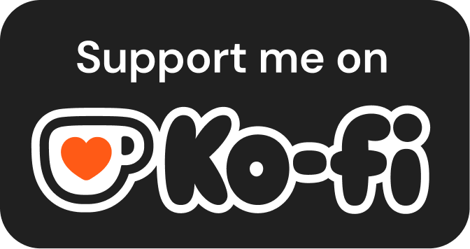

Many people love fancy READMEs for their profiles but I'll just leave some advice here. Advice that I realized and changed my life:
- Slow down. Knowledge isn't about consumption. It's about what you do with it.
- Your time is finite. You can't do everything, so you have to make sacrifices. What I mean is:
    - Sacrificing many learning resources for a single one. Just start somewhere.
    - Sacrificing drowning in many fields of knowledge for a single one or a few that just solve your own problems.
- Spend some time off technology and be in your thoughts. You'll be surprised how many creative ideas you get!
- You'll never be ready. You'll never be done. So, go spend some time with people you love before it's too late

